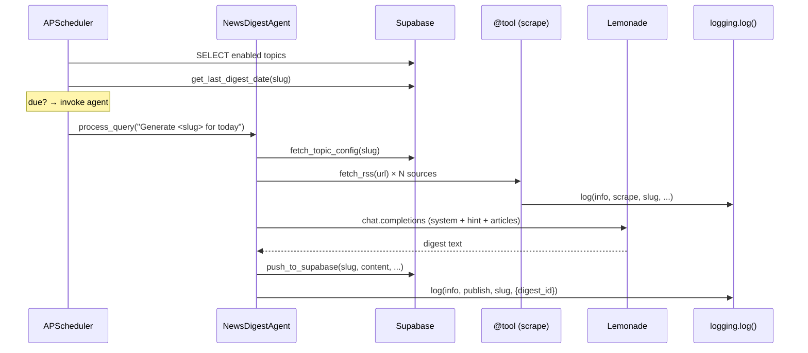

# News Digest Agent — Architecture

This document is the canonical design reference for the News Digest Agent. Every implementation issue links to a section here (`§n`). When behavior diverges from this document, update the section in the same PR.

Companion documents:
- [`CLAUDE.md`](../CLAUDE.md) — Claude Code tool-use guidance (focused on *how* to work in this repo, not the system design)
- [`README.md`](../README.md) — user-facing overview, setup, operations

---

## §1 System overview

The News Digest Agent is a single-user, audio-first news aggregator. It runs 24/7 on an AMD Strix Halo workstation (Ubuntu 24.04, 128 GB RAM). A scheduled agent scrapes curated sources, summarizes them with a local LLM (Lemonade Server), and publishes digests to Supabase. The user consumes digests via a mobile web app that reads them aloud with the browser's Web Speech API.

Design invariants:

1. **The LLM is the summarizer.** No separate summarization module. Output quality is tuned through prompts, not code.
2. **Tools are pure functions.** Each `@tool` performs one narrow operation. The agent's reasoning orchestrates them.
3. **Config is data.** Topic definitions live in Supabase, not source.
4. **Local first, cloud for storage.** Inference is local; only digests and logs traverse the network.
5. **Single user.** No multi-tenant concerns. Auth is one email allowlist.

```
                      ┌───────────────────────────────────┐
                      │     NewsDigestAgent(Agent,         │
                      │                  DatabaseMixin)    │
                      │                                    │
┌─────────────┐       │  ┌──────────┐   ┌──────────────┐  │       ┌──────────┐
│  Web Sources │──────▶│  │ @tool    │──▶│ Lemonade     │  │──────▶│ Supabase │
│  (RSS, HTML) │       │  │ scrapers │   │ Server (LLM) │  │       │ (REST)   │
└─────────────┘       │  └──────────┘   └──────────────┘  │       └──────────┘
                      │        │                           │
                      │        ▼                           │
                      │  ┌──────────────┐                  │
                      │  │ DatabaseMixin │                  │
                      │  │ (SQLite)      │                  │
                      │  └──────────────┘                  │
                      └───────────────────────────────────┘
                                   ▲
                                   │
                      ┌────────────────────┐
                      │ APScheduler + systemd│
                      └────────────────────┘
```

---

## §2 Component map

### §2.1 `NewsDigestAgent` — `src/news_digest/agent.py`
Responsibility: orchestrate a single topic run. Inherits from `gaia.agents.base.agent.Agent` and mixes in `gaia.database.DatabaseMixin`. Registers all `@tool` functions in `_register_tools()` and returns the system prompt from `_get_system_prompt()`.
Interface: `process_query(query: str) -> str` — the only entry point external callers use.
Implemented by: #4 (hello-world scope), #9 (full scope).

### §2.2 Tools — `src/news_digest/tools/*.py`
All tools are module-level functions decorated with `@gaia.agents.base.tools.tool`. They take primitives or simple dicts and return serializable dicts. They log via `news_digest.logging.log()`, never via `print` or ad-hoc Supabase calls.

- `scraping.fetch_rss(url, since_hours=24) -> list[dict]` (#5)
- `scraping.fetch_html(url, selector=None) -> dict` (#6)
- `scraping.parse_article(url) -> dict` (#6, uses `trafilatura`)
- `publishing.fetch_topic_config(slug) -> dict` (#8)
- `publishing.push_to_supabase(topic_slug, summary, items, sources_used, token_count, content=None) -> dict` (#8, #58)
- `publishing.get_last_digest_date(topic_slug) -> str | None` (#8)
- `social.fetch_reddit(subreddit, ...) -> list[dict]` (#21, Epic 7)

### §2.3 Config — `src/news_digest/config.py` (#25)
A `pydantic-settings` `Settings` class, module-level singleton. Loaded once at import. Every module imports from here; no `os.getenv()` elsewhere in the codebase.

### §2.4 Logging envelope — `src/news_digest/logging.py` (#26, #15)
`log(level, category, topic_slug=None, message, metadata=None)` writes to Supabase `system_logs` with a local SQLite fallback at `data/system_logs_fallback.sqlite`. `drain_fallback()` ships accumulated rows upward when Supabase is reachable again.

### §2.5 Prompts — `src/news_digest/prompts.py`
A `SYSTEM_PROMPT` constant plus helpers that concatenate it with per-topic `prompt_hint` pulled from `digest_topics`. Extended across #7, #16, #17, #18, #19.

### §2.6 Scheduler — `src/news_digest/scheduler.py` (#13)
APScheduler `BlockingScheduler` process. On each 15-minute tick: pulls enabled topics from Supabase, checks `get_last_digest_date` against cadence, invokes `agent.process_query()` per due topic. Runs one topic at a time (`max_instances=1`) because the local LLM is the bottleneck.

### §2.7 Web app — `web/` (#10–#12, #27, #20, #22)
Vanilla JS + Vite, deployed to Cloudflare Pages. Talks to Supabase via `@supabase/supabase-js`. Auth is Supabase magic link restricted by an email allowlist. All data access goes through RLS with the anon key.

### §2.8 systemd service — `systemd/news-digest.service` (#14)
`Type=simple`, `Restart=on-failure`, bounded by `StartLimitBurst`. Loads `.env` via `EnvironmentFile`. Memory capped at 16 GB as a guardrail despite the 128 GB host.

---

## §3 Data model

### §3.1 Supabase — `supabase/migrations/0001_init.sql` (#3)

```sql
-- Topic configuration
CREATE TABLE digest_topics (
  id serial PRIMARY KEY,
  name text NOT NULL,
  slug text NOT NULL UNIQUE,
  cadence text NOT NULL CHECK (cadence IN ('24h','7d')),
  sources jsonb NOT NULL,           -- list of {type: 'rss'|'html'|'reddit', url, ...}
  prompt_hint text NOT NULL,
  enabled boolean NOT NULL DEFAULT true,
  created_at timestamptz NOT NULL DEFAULT now()
);

-- Published digests
CREATE TABLE digests (
  id uuid PRIMARY KEY DEFAULT gen_random_uuid(),
  topic_slug text NOT NULL REFERENCES digest_topics(slug),
  content text NOT NULL,            -- flat TTS-safe prose; derived from summary+items on #58+ rows
  summary text,                     -- short top-level overview; null on pre-#58 rows
  items jsonb,                      -- ranked items (see §7.1); null on pre-#58 rows
  cadence text NOT NULL,
  digest_date date NOT NULL,
  sources_used jsonb NOT NULL,
  token_count integer,
  prompt_version text NOT NULL,     -- sha256[:12] of SYSTEM_PROMPT + prompt_hint at gen time
  created_at timestamptz NOT NULL DEFAULT now(),
  UNIQUE (topic_slug, digest_date)  -- idempotent scheduler retries
);
CREATE INDEX ON digests (topic_slug, digest_date DESC);

-- Structured logs
CREATE TABLE system_logs (
  id uuid PRIMARY KEY DEFAULT gen_random_uuid(),
  timestamp timestamptz NOT NULL DEFAULT now(),
  level text NOT NULL CHECK (level IN ('info','warn','error')),
  category text NOT NULL,           -- schedule|scrape|summarize|publish|feedback|hello_world|system
  topic_slug text,
  message text NOT NULL,
  metadata jsonb,
  created_at timestamptz NOT NULL DEFAULT now()
);
CREATE INDEX ON system_logs (created_at DESC, category);
```

RLS posture:
- `anon` role: `SELECT` on `digests`, `digest_topics` (enabled-only), `system_logs`.
- `service_role`: full access; used by the agent only.
- No `INSERT/UPDATE/DELETE` grants to `anon`.

### §3.2 Local SQLite — `data/news_digest.db`
`DatabaseMixin` handles run logs and article caching. Schema is GAIA-defined; we do not extend it.

### §3.3 Fallback SQLite — `data/system_logs_fallback.sqlite`
Mirrors `system_logs` schema with one extra column `synced_at timestamptz NULL`. `drain_fallback()` sets `synced_at` after a successful Supabase insert and eventually vacuums.

### §3.4 Prompt versioning
`prompt_version` is `sha256(SYSTEM_PROMPT + '\n' + prompt_hint)[:12]` at generation time. This makes every digest attributable to a specific prompt. A new issue or a scripted query can answer "did quality regress after we changed the prompt on date X?".

---

## §4 Control flow

Sequence of a single topic run.



Scheduler tick cadence: every 15 minutes. Topic cadence checked against `get_last_digest_date`. Jitter: 0–300 s random delay per topic to spread load.

---

## §5 Cross-cutting patterns

Every developer touching this codebase needs these five patterns in working memory.

### §5.1 Config loader (#25)

```python
from news_digest.config import settings
settings.supabase_url          # validated string
settings.lemonade_heavy_model  # e.g., "Qwen2.5-32B-Instruct"
```

Loaded once at process start via `pydantic-settings`. Tests override with `monkeypatch.setenv` before import, or instantiate `Settings(...)` directly.

### §5.2 Logging envelope (#26, #15)

```python
from news_digest.logging import log
log(level="info", category="scrape", topic_slug="ai_models",
    message=f"fetched {len(entries)} entries",
    metadata={"url": url, "duration_ms": elapsed})
```

Contract: never raises. Supabase failure → SQLite fallback → still never raises. Caller does not inspect the return value.

### §5.3 Retry policy

Scraping tools only. `@retry` lives on a **private helper**, not on the public `@tool`-decorated function. This separation is intentional: `@tool` functions must never raise — they always return a typed value (e.g. `list[dict]`). Isolating the retry budget inside the helper preserves that contract.

```python
from tenacity import (
    retry, retry_if_not_exception_type,
    stop_after_attempt, wait_exponential,
)

class _NonRetryableHttp(Exception):
    """4xx (except 429) and oversized body — skip retry, log once."""

@retry(
    stop=stop_after_attempt(3),
    wait=wait_exponential(multiplier=1, max=30),
    reraise=False,
    retry=retry_if_not_exception_type(_NonRetryableHttp),
    retry_error_callback=_retry_returns_none,   # returns None sentinel on exhaustion
)
def _fetch_feed_bytes(url: str, ...) -> bytes | None: ...

@tool
def fetch_rss(url: str, since_hours: int = 24) -> list[dict]:
    raw = _fetch_feed_bytes(url)   # None → retries exhausted
    if raw is None:
        log("warn", "scrape", ...)
        return []
    ...
```

Key knobs:
- **429 is retryable.** `_NonRetryableHttp` is raised only on 4xx ≠ 429. 429 falls through to `raise_for_status()` and is retried with backoff.
- **Exhaustion → `None` sentinel.** `reraise=False` alone would raise `tenacity.RetryError`; the `retry_error_callback` intercepts it, captures the last exception for diagnostic logging, and returns `None`. The public tool translates `None` to `[]` and logs once.
- **Single-log invariant.** `_fetch_feed_bytes` never calls `log()`. All logging happens in the public tool so each failure mode maps to exactly one log entry.

Publishing and LLM calls do **not** retry automatically — failures are meaningful and should be logged and surfaced. The scheduler handles topic-level failure isolation.

### §5.4 Per-domain rate limiter

Module-level dict in `scraping.py`: `_last_fetch: dict[str, float] = {}`. Before each request, sleep to enforce 1.5 s since the last fetch to the same domain. Thread-safe via `threading.Lock`.

### §5.5 Kill switch

Before dispatching to any topic, the scheduler re-reads `digest_topics.enabled`. Setting `enabled=false` in Supabase pauses that topic without SSH. A `system` category log entry records the pause. The scheduler itself is paused by `systemctl stop news-digest`.

---

## §6 Failure modes

| Failure | Detection | Recovery | Logged as |
|---|---|---|---|
| RSS feed 5xx / DNS | `httpx` exception | `tenacity` retry 3×; skip source on exhaustion | `warn` / `scrape` |
| Malformed feed entries | `feedparser` raises / missing fields | drop entry, continue | `warn` / `scrape` |
| Lemonade Server down | connection refused | log, skip topic, continue scheduler | `error` / `summarize` |
| Digest too long / short | word-count check post-gen | one re-prompt with "too long/short"; then accept | `warn` / `summarize` |
| Supabase publish fails | `supabase-py` exception | write fallback SQLite; `drain_fallback` retries | `error` / `publish` |
| Duplicate publish for a date | `UNIQUE(topic_slug, digest_date)` | `ON CONFLICT UPDATE` (idempotent) | `info` / `publish` |
| Scheduler crash | process exits | systemd `Restart=on-failure` within 60 s | journald |
| Crash loop | `StartLimitBurst` exceeded | systemd stops restarting; surfaces in `journalctl` | journald |
| Missed digest (24h topic) | scheduled Edge Function 12:00 ET | writes `warn` / missed_digest row; UI surfaces | `warn` / `system` |
| Source consistently failing | materialized view < 50% success / 7 d | UI surfaces red; user manually disables or updates source | view only |

---

## §7 Prompt architecture

### §7.1 System prompt and output contract
Single `SYSTEM_PROMPT` constant in `prompts.py`. The LLM assembles a
**structured digest** — a short top-level `summary` plus a ranked `items` array —
and calls `push_to_supabase(topic_slug, summary, items, sources_used, token_count)`.

Canonical item shape (Python dict keys and TypeScript `DigestItem` interface match verbatim):
```jsonc
{
  "headline": "one-line description",
  "blurb":    "1–2 sentences — what happened (shown collapsed)",
  "detail":   "fuller prose — why it matters, specifics/numbers (expandable)",
  "metadata": {
    "sources": [{"title": "Source Name", "url": "https://…"}],
    "tags":    ["optional", "tags"]
  }
}
```

`content` (the `text NOT NULL` column) is **derived** by `flatten_digest(summary, items)`
inside `push_to_supabase`. It is plain prose, no URLs or markdown — kept as the TTS
source (#11) and the backward-compat fallback for pre-#58 rows where `summary`/`items`
are null. Source links live only in `metadata.sources`.

Hard rules for the output:
- `summary` and `blurb`: clean prose, no raw URLs.
- `metadata.sources`: machine-readable source links (rendered as `<a>` in the web app,
  guarded to http(s) only against XSS via LLM-injected `javascript:` / `data:` schemes).
- Rank items by significance; explain why each item matters in `detail`.
- Aim for one to two sentences of `summary` and three to seven items.

### §7.2 Per-topic prompt hint
`digest_topics.prompt_hint` contains topic-specific steering: what to emphasize, what to exclude. Concatenated after `SYSTEM_PROMPT` at run time.

**Per-item sentiment (world_news, #19).** The `world_news` prompt_hint instructs the LLM to set a `sentiment` key inside each item's `metadata` object — a dedicated field, deliberately *not* an element of the free-form `tags` array. Allowed values (lowercase): `positive`, `negative`, `neutral`, `concerning`; the canonical set lives in `SENTIMENT_TAGS` (`src/news_digest/prompts.py`) and is mirrored by the web renderer's whitelist. The web app (`web/src/views/digest-card.ts`) renders a small badge alongside the item headline when `metadata.sentiment` is one of the four values, and silently ignores anything else — the value is LLM-generated, so it is validated before display and never interpolated as HTML.

### §7.3 Dedup context
When running a topic that overlaps with another (e.g., `ai_updates` after `ai_models`), the agent fetches the previous day's sibling digest and includes it in the prompt: *"Do not repeat items already covered in this context."* Managed in the agent, not the prompt templates.

### §7.4 Prompt versioning
At generation time, compute `sha256(SYSTEM_PROMPT + '\n' + prompt_hint)[:12]` and store on `digests.prompt_version`. A history of prompt changes lives in git; `prompt_version` ties any published digest to its exact prompt text.

### §7.5 Length enforcement
Post-generation: `enforce_length(summary, items, regenerate)` measures word count over
`flatten_digest(summary, items)` — the flattened structured text, not the raw LLM
output. If the word count is outside the 500–800 ± 20 % band (400–960), re-prompt
once with a length-correction hint. Accept the second attempt regardless. Returns a
`(summary, items)` tuple. `enforce_length` is a pure function and is not currently
wired into the agent loop; it is available for future integration.

---

## §8 Security & secrets

- **`.env` is the boundary.** It lives on the Strix Halo only. `systemd` loads it via `EnvironmentFile`. It is in `.gitignore`. `.env.example` tracks the schema.
- **Service-role key:** used only by the agent process. Never shipped to the browser.
- **Anon key:** used by the web app. Relies on RLS.
- **Auth allowlist:** Supabase Edge Function (trigger on `auth.users` insert) rejects sign-ups not on the allowlist.
- **Scraping hygiene:** identifiable `User-Agent`, robots.txt respected where defined, 1.5 s polite delay per domain.
- **URL safety:** `_validate_url` in `scraping.py` rejects non-`http(s)` schemes and resolves the hostname via `socket.getaddrinfo`, blocking loopback, RFC 1918, link-local, multicast, and reserved IPs before any bytes leave the process. This guards against prompt-injection SSRF (LLM coerced into fetching `localhost:13305` or cloud IMDS). Implemented in #5.

---

## §9 Deployment topology

- **Host:** AMD Strix Halo, Ubuntu 24.04. Single user account runs both the agent and Lemonade.
- **Process:** one `news-digest.service` managed by systemd.
- **Data volume:** `/var/lib/news-digest/` holds `data/` (SQLite DBs). Writable only by the service user.
- **Lemonade:** separate systemd unit, always-on. Heavy model pinned resident.
- **Web app:** Cloudflare Pages, deploys from `web/` directory on `main`.
- **Supabase:** free tier, project `News Digest` (distinct from Command Center).
- **Upgrades:**
  1. `git pull && pip install -e ".[dev]"`
  2. Apply any new migrations: `supabase db push`
  3. `systemctl restart news-digest`
  4. Verify log view shows a `system`/`startup` entry.

---

## §10 Testing strategy

| Layer | Tool | Scope |
|---|---|---|
| Unit | `pytest` | Pure functions in `tools/*.py`, parsers, `config`, `logging` |
| Integration | `pytest` + test Supabase project | Round-trip: tool writes, RLS enforcement |
| Smoke | Manual `python -m news_digest "Generate..."` | End-to-end run against production Lemonade + Supabase |
| UI | Manual on iPhone Safari | #10–#12, #27 |

No mocked Supabase in integration tests — per project convention, mocks mask migration/RLS issues. Instead, a dedicated test project and schema reset between runs.

CI (#24) runs unit + integration. Smoke and UI tests are manual and gate each epic exit.

---

## §11 Epic-to-component matrix

| Component | E0 | E1 | E2 | E3 | E4 | E5 | E6 | E7 | E8 |
|---|---|---|---|---|---|---|---|---|---|
| `docs/architecture.md` | ✚ | · | · | · | · | · | · | · | · |
| CI / pre-commit | ✚ | · | · | · | · | · | · | · | · |
| `config.py` | · | ✚ | · | · | · | · | · | · | · |
| `logging.py` | · | ✚ | · | · | ● | · | · | · | · |
| `agent.py` | · | ✚ | ● | · | · | · | · | · | · |
| `tools/scraping.py` | · | · | ✚ | · | ● | ● | · | ● | · |
| `tools/publishing.py` | · | · | ✚ | · | ● | · | · | · | · |
| `prompts.py` | · | · | ✚ | · | · | ● | · | · | ● |
| `scheduler.py` | · | · | · | · | ✚ | · | · | · | · |
| `systemd/` | · | · | · | · | ✚ | · | · | · | · |
| Supabase schema | · | ✚ | · | · | · | · | ● | · | ● |
| `web/` | · | · | · | ✚ | ● | · | ● | · | ● |

Legend: ✚ introduces · untouched ● extends

Tracking issues: #28 (E0), #29 (E1), #30 (E2), #31 (E3), #32 (E4), #33 (E5), #34 (E6), #35 (E7), #36 (E8).

---

## §12 Glossary & links

- **GAIA** — AMD's local-first agent framework. [amd/gaia](https://github.com/amd/gaia). Primitives used: `Agent`, `@tool`, `DatabaseMixin`, `LemonadeClient`.
- **Lemonade Server** — AMD-optimized LLM runtime with OpenAI-compatible API. Default endpoint `http://localhost:8000/api/v1`.
- **Strix Halo** — AMD's APU for workstations; hosts this project 24/7.
- **BoardDocs** — platform hosting township meeting minutes for local news topic.
- **PRAW** — Python Reddit API Wrapper (Epic 7 source).
- **RLS** — Supabase Row-Level Security; primary access-control mechanism.
- **Cadence** — a topic's publish frequency; currently `24h` or `7d`.

---

*Last updated: 2026-05-09. Changes to architecture land on `main` with their implementation PR; this document is the source of truth.*
